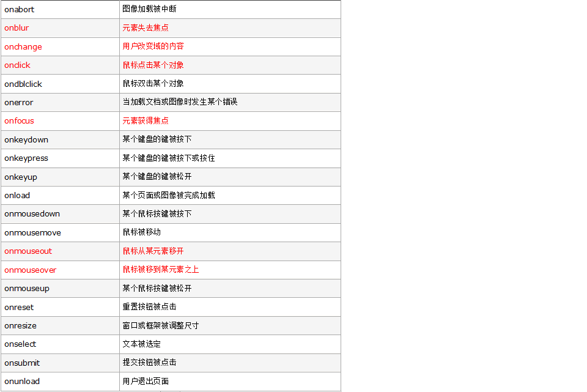
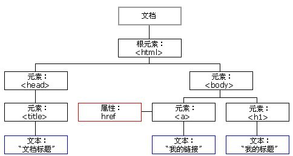

#   DOM(document object model)文档对象模型

+   事件
    ```
        - JS是以事件为驱动的一门语言;

    ```
+   事件三要素:
    ```
        1. 事件源: 触发事件的对象,比如:button按钮;

        2. 事件: 触发的事件的类型,比如:是点击触发还是修改内容触发;

        3. 事件驱动: 即事件执行的结果,比如:点击按钮之后变红,变红就是结果;
    ```
+   JS执行事件的步骤:
    ```
        1. 获取事件源;

        2. 绑定事件

        3. 编写事件驱动函数
    ```

+   常见的事件:
    

---
+   DOM的数据结构(树状)

    
    ```
        - HTML的组成部分为节点,在html中一切都是节点
        
        - document 文档节点

        - html标签是一个根节点

        - 每一个标签是一个元素节点

        - 标签中的文字是文本节点

        - 标签中的属性是属性节点

        - 标签中的注释是注释节点
    ```

+   获取节点:
    ```
        1. 通过id获取节点:
            
            document.getElementById();
        
        2. 通过class获取节点:(存在兼容问题不兼容i9以下)

            document.getElementsByClassName();
            // 返回值是一个伪数组,HTMLcollection;

        3. 通过标签获取节点:
            document.getElementsByTagName();
            // 返回值是一个伪数组,可以通过通配符获取所有的标签;

        4. 通过选择器获取单个标签(h5新方法,兼容ie8):
            document.querySelector();
            // 多个标签只会获取第一个;
        
        5. 通过选择器获取标签:

            document.querySelectorAll();
            // 返回值是一个伪数组;
    ```

+   获取父节点:
    ```
        - 一个节点只有一个父节点,语法:
        
            node.parentNode;

    ```
+   获取兄弟节点:
    ```
        1. 获取上一个兄弟节点:
            
            - node.previousSibling; 
            // 在9以下指上一个元素节点,在谷歌等浏览器中指下一个任意类型的节点;

            - node.previousElementSibling;
            // 下一个元素节点,不兼容ie9以下

            - 兼容: node.previousElementSibling || node.previousSibling;
    ```    
    ```
        2. 获取下一个兄弟节点:
            
            - node.nextSibling;
            // 兼容同previousSibling;

            - node.nextElementSibling
            
            - 兼容: node.nextElmentSibling || node.nextSibling;
    ```  
+   获取子节点: 
    ```
        1. 获取第一个子节点：

            - pnode.firstChild;
            // 兼容同previousSibling

            - pnode.firstElementChild;
            
            - 兼容写法:
            pnode.firstElmentChild || pnode.firstChild;
    ```
    ```
        2. 获取最后一个子节点:

            - pnode.lastChild;
            // 兼容同上

            - pnode.lastElementChild;

            - 兼容写法:
            pnode.lastElementChild || pnode.lastChild;
    ```
    ```
        3. 获取所有的子节点:

            - pnode.childNodes
            // 返回所有类型的子节点集合

            - pnode.children
            // 返回元素子节点,但ie9以下包含注释节点


        4. 判断节点类型, nodeType:

            - node.nodeType == 1, 表示元素节点

            - node.nodeType == 2, 表示属性节点

            - node.nodeType == 3, 表示文本节点

            - node.nodeType == 8, 表示注释节点     

        5. 兼容:

            function getChildren(pNode){

                var nodes =  pNode.children;

                var elNodes = [];

                for(var i = 0 ; i < nodes.length ; i++ ){

                    if(nodes[i].nodeTyoe == 1){

                        elNodes.push(nodes[i]);
                    }
                }

                return elNodes;
            }
    ```

+   节点操作:
    ```
        - 获取节点都是属性,操作节点都是函数/方法;

        1. 创建节点
        
            - document.createElement();
            // 创建节点之后不会显示到页面上,要配合插入节点使用;

        2. 插入子节点

            - pNode.appendChild(cNode);
            // 按先后顺序插入

            - pNode.insertBefore(cNode,参照节点);
            // 如果参照节点为null,则会按先后顺序插入到最后;

        3. 删除子节点

            - pNode.removeChild(cNode);

            - pnode.parentNode.removeChild(cNode);
            // 自己删除自己

        4. 克隆节点:

            - node.cloneNode() 
            // 浅克隆,不传参数时为浅克隆,浅克隆不会复制后代节点;

            - node.cloneNode(true)
            // 深克隆,参数为true为深克隆,会克隆后代节点
    ```
+   节点属性操作:
    ```
        1. 获取属性:    
            - node.getAttribute(属性名);
        
        2. 设置属性:

            - node.setAttribute(属性名,属性值);

        3. 删除属性：

            - node.removeAttribute(属性名); 
    ```
+   value / innerHTML / innerText / textContent
    ```
        - value 属性一般只对表单有效;

        - innerHTML会解析标签,innerText不会解析标签;

        - innerText和textContent用法相同,但后者较老可以支持老版本的火狐;

        - 使用innerHTML追加元素会使之前的元素绑定的事件失效;
    ```

+   其他常用属性:
    ```
        - document.body, 可以直接获取body标签;

        - document.documentElement, 可以直接获取html标签;

        - document.all, 获取document文档下所有的标签(直接打印返回值结果是undefined,类型也是undefined) 但是可以通过索引获取到值;

    ```
---
+   操作样式:
    ```
        - 通过node.style 读写样式操作的都是内联样式,这种方式无法获取到内联以外的样式;

        1. 获取当前标签的所有样式(只读):
            
            - window.getComputedStyle(元素,伪元素(通常设置为null)).css属性;
            // 不兼容ie9以下,

            - node.currentStyle.css属性;
            // 只支持ie
    ```
    ```
        2. 二者区别:
            - window.getComputedStyle(el,null):如果没有设置样式的宽高等属性,不会获取到默认值auto,而是获取当页面上当前元素的宽高等;

            - currentStyle.css属性,会获取到默认值auto,为了避免获取到auto,尽量给css的宽高等属性一个初始值;
    ```
    ```
        3. 兼容:

            - window.getComputedStyle? window.getComputedStyle(node,伪元素):node.currentStyle;
    ```

