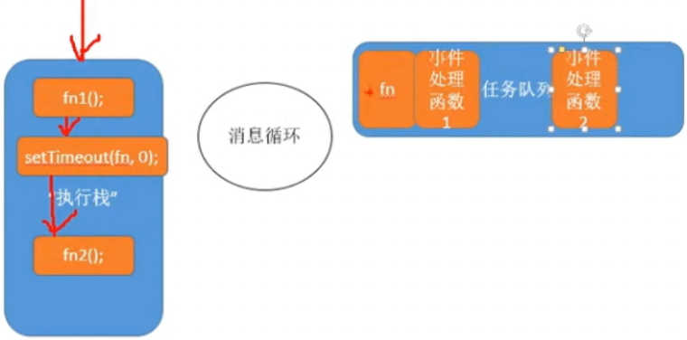

+   闭包:
    ```
        - 在一个作用域中可以访问另一个作用域的变量
        可以说闭包是一个函数;
        也可以说闭包是一种现象
        闭包特点: 延展了函数作用的域的范围和生命周期;
        例:
            function fn(){
                var n = 10;
                return n;
            }

            var n = fn(); // 此时fn作用域销毁,没有产生闭包

            function fn(){
                var n =10;
                return function(){
                    return n;
                }
            }
            var f = fn(); 此时fn中的n保存在返回的函数对象中,产生闭包fn 

        立即执行函数中也会发生闭包,变量和函数都会是闭包中的变量

        (function(){
            var n = 1;
            function fn(){
                f1();
            }
            function f1(){

            }

        })();

        闭包:在外层函数执行完内存并没有被立即释放; 因为性能是降低的


    闭包案例1: 
        for(var i = 0 ; i < 3 ; i++){
            
            btn[i].onclick = (function(i){
                return function(){
                    console.log(i);
                }
            })(i)
        }

    闭包案例2: 
        for(var i = 0 ; i < 3 ; i++ ){
            (function(i){

                setTimeOut(function(){
                    console.log(i);
                },0)

            })(i)
        }

    闭包案例3: 
        function makeFun(size){
            return function(){
                document.body.style.fontSize = size + 'px';
            }
        }
        btn1.onclick = makeFun(12);
        btn2.onclick = makeFun(14);
        btn3.onclick = makeFun(16);
        
    思考1: 
        var name = 'The Window';
        var object = {
            name = 'obj',
            getFun = function(){
                return function(){
                    return this.name;
                }
            } 
        }   

        console.log( object.getFun()());

        // 结果为 The Window 
        // 代码运行可以分为两步: var  fun = object.getFun();  fun(); --> 此时是window调用   

    思考2:
        var name = 'The Window';
        var object = {
            name = 'obj',
            getFun = function(){
                var that = this;
                return function(){
                    return that.name;
                }
            } 
        }
        
        console.log( object.getFun()());

        // 结果为obj  : var fun = object.getFun();  fun(); --> 此时的this指向window,而return 的是that,that保存了外层函数的this, 此时发生了闭包


    js如何执行代码:
    ``` 
      
    ```
        js按顺序执行完执行栈以后,通过消息循环执行任务队列(定时器和事件的函数会放到任务队列)的任务执行完扔掉,
    ```

