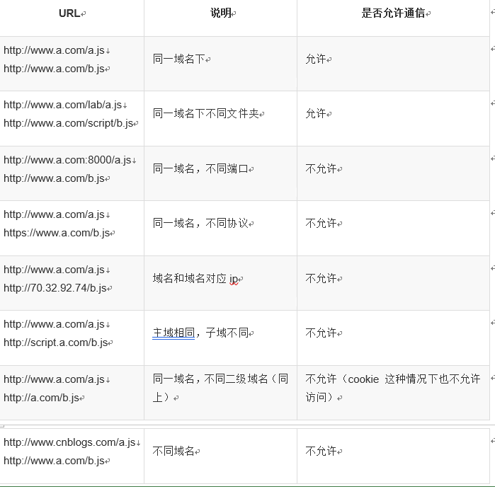

##  Ajax( Asynchronize JavaScript and XML ,异步javaScript和XML) 
---

+   什么是Ajax
    ```
        - Ajax是在不加载整个页面的情况下与服务器交换数据并更新部分页面的技术;

        - 早期使用XML的较多现在一般使用JSON所以Ajax已经体现不出XML的特征了;
    ```

+   Ajax可以做什么(了解)
    ```
        - 显示新的html内容而不用载入整个页面,每次请求的时候不加载整个页面,只加载一部分或一些数据;

        - 提交一个表单并且立即显示结果

        - 登录不用跳转到新的页面

        - 遍历数据库加载更多而不用刷新页面
        ...
    ```

+   Ajax的正确打开方式
    ```
        1. 使用逻辑

            - 在ejs页面中通过Ajax请求数据并接收响应的结果
            - 在routes下的js文件(后端文件)中拦截提交的路径并响应需要的数据到ejs页面中;

        - get请求 :
            
            // 1. 创建XMLHttpRequest实例对象
            var xhr = new XMLHttpRequest();

            // 2. 设置请求方式
            xhr.open('get','/test?key=value&key=value',true(是否异步));

            // 3. 发送请求 
            xhr.send();

            // 4. 监听状态
            xhr.onreadystatechange = function(){
                
                // xhr.readyState == 4  发送成功 等待结果
		    	// xhr.status == 200  请求成功 返回结果
                // 判断请求是否成功
                if(xhr.readyState == 4 &&  xhr.status == 200){

                    // 获取响应数据,返回的是字符串
                    var rs = xhr.responseText; 
                }

            }

        - post请求:
            1. 创建XMLHttpRequest实例对象
            var xhr = new XMLHttpRequest();

            2. 设置请求方式
            xhr.open('post','url');

            3. 设置请求头
            xhr.setRequestHeader("Content-type","application/x-www-form-urlencoded");

            4. 发送请求,请求参数写在send中,参数为字符串类型,可传一个JSON字符串
            xhr.send(str); 

            5. 监听状态
            xhr.onreadystatechange = function(){

                // xhr.readyState == 4 发送成功 等待结果, xhr.status == 200 请求成功 返回结果
                
                // 当请求和发送成功的时候,获取响应回来的内容
                if(xhr.readyState == 4 && xhr.status == 200){
                
                    // 获取响应内容
                    var rs = xhr.responseText;
                }
            };  

    ```

+   get请求个post请求的区别
    ```
        1. post相对安全(post请求参数不会作为url的一部分,post不会保存到浏览器浏览记录中,post不会被写入服务器日志,post不会被缓存);

        2. post发送数据大小没有限制,get发送数据的大小受url长度的限制;

        3. post可以发送更多的数据类型;

        4. post请求比get慢;

        5. post一般用来写入或修改数据,get一般用来搜索,排序和筛选之类的操作(例:淘宝和支付宝的搜索查询),目的是资源的获取,读取数据;

    ```

+   Ajax的封装
    ```
        var options = {
            url:'',
            type:'get',
            data:{},
            success:function(){}
        } 

        function myAjax(options){
            var isPost = options.type.toLowerCase() == 'post';
            var param = '';
            if(options.data){
                for(var key in data){
                    param += '&'key+'='+date[key];
                }
                param = param.substr(1);
            }

            //1. 创建XMLHttpRequest();    
            var xhr = new XMLHttpRequest();

            //2. 设置请求方式
            if(!isPost){
                xhr.open(options.type,options.url+'?'+param);
            }else{
                xhr.open(options.type,options.url);

            }
            if(isPost){
                //3. 设置请求头
                xhr.setRequestHeader("Content-type","application/x-www-form-urlencoded");
            
                //4. 发送请求,请求参数写在send中,参数为字符串类型,可传一个JSON字符串
                xhr.send(param); 
            }else{
                xhr.send();//xhr.send(null);
            }
            


            //5. 监听状态
            xhr.onreadystatechange = function(){

                // xhr.readyState == 4 发送成功 等待结果, xhr.status == 200 请求成功 返回结果
                
                // 当请求和发送成功的时候,获取响应回来的内容
                if(xhr.readyState == 4 && xhr.status == 200){
                
                    // 获取响应内容
                    var rs = xhr.responseText;

                    options.success&&options.success(rs);
                }
            };  

        }
    ```

+   jQuery封装的的Ajax
    ```
        // 向jQuery静态方法ajax中添加一个对象为参数
        $.ajax({
            type:'get/post',
            url:'/xx',          // 如果为get类型可以直接在后面写?key=value&key=value,也可以把参数写在data中
            data:{              // 请求参数可以写为字符串,也可以写为对象的形式

            },  
            success:function(rs){ //请求成功之后调用的回调函数,响应回来的数据传递到形参中
            },
            error:function(argument){ //请求失败时候调用

            }

        });
    ```
+   Ajax格式化表单
    ``` 
        $('form').serialize(), 该方法会把对应的表单中带name的属性格式化成键值对的形式: name:value&name:value;
    ```

+   跨域
    ```
        1. 同源: 同源策略是浏览器的一种安全策略,所谓同源是指协议,域名,端口完全相同,只有同源通过ajax请求;

        2. 同源策略:请求的url地址,必须与源地址同源;

    ```
    
    ```
        2. 跨域方案:
            
            - jsonp

            - cors        
    ```

+   jsonp 跨域请求
    ```
        - 由于同源策略的限制,导致aja无法直接获取其他域的数据,但是有人发现script和img标签的src可以绕过同源策略的限制,jsonp的本质就是利用这些标签可跨域性,由服务器返回一个预先定义好的回调函数调用,例:cb({相应的数据}),并且将服务器数据以参数的形式传递过来,此方法需要前后端配合完成;

        - 缺点:jsonp跨域只能使用get请求
        - 注意:只能以get方式请求
    ```
+   cors 跨域请求
    ```
        - cors跨域请求是现在浏览器跨域请求最常用的一种方式;
        - 使用方法: 一般是需要后端人员在处理请求数据的时候,添加允许跨域的相关操作.
        - cors跨域支持get和post请求,在后端设置了cors跨域之后,ajax可以正常请求;
    ```
+   proxy代理 跨域


    


+   客户端与服务器

+   通信协议

+   网络,IP地址,端口,域名

+   静态网站,动态网站

+   动态网站技术php常用语法

+   同步与异步

+   ajax实现动态请求效果


