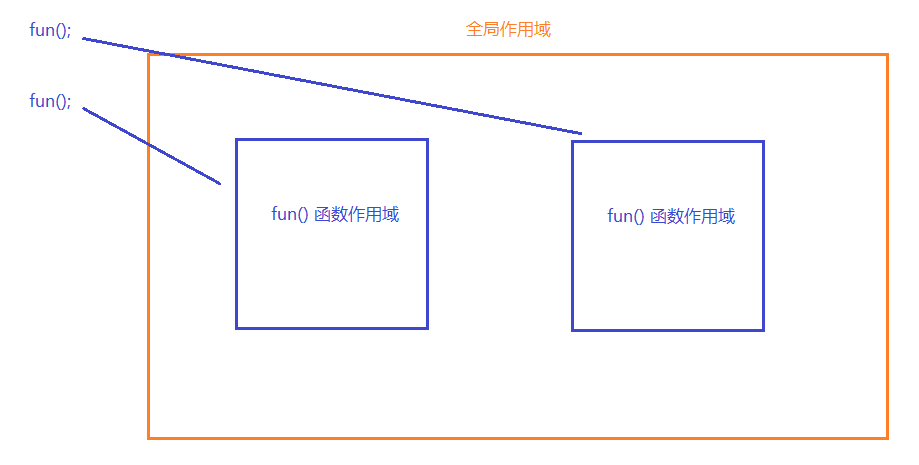

#  作用域

##  全局作用域

1. 直接编写在JS标签中的代码都在全局作用域

2. 全局作用域在页面打开的时候创建, 页面关闭的时候销毁

3. 全局作用域中, 有一个全局对象`window`可以直接使用, 它代表的是一个浏览器窗口。

4. 声明的全局变量和函数都作为`window`的属性存在, 且`window`可以省略不写。

5. 全局作用域中声明的变量, 在全局范围的任意位置都可以访问到

##  函数作用域

1. 函数作用域在调用函数的时候创建, 函数执行完毕以后函数作用域销毁(因此在函数内给全局变量赋值, 需要调用以后才会生效)

2. 每调用一次函数就会创建一个函数作用域, 即使是多次调用同一个函数, 也会创建出各自独立的作用域

    

3. 函数作用域可以访问到全局变量, 但全局作用域访问不到函数作用域中的局部变量

4. 当在函数作用域中操作一个变量时, 会现在函数作用域中寻找, 有就直接使用, 没有就向 **上一级作用域** 寻找, 直到找到 全局作用域。
> 在函数作用域中要想访问同名的全局变量可以通过 `window.变量名` 访问

5. 定义形参就相当于在函数作用域中声明了变量。因此, 调用函数中没有传值的形参, 会报undefined。

##  变量声明提前(预编译)

1. 使用`var`关键字声明的变量, 会在所有代码执行之前被声明。但是不会进行赋值操作, 要执行到赋值的那一行才会被赋值。
> 如果没有用`var`声明就使用,会报错。 
> **注意:** 在函数中使用的变量若在该函数作用域和全局作用域中都没有声明, 该变量会被隐形声明为全局变量, 这是错误的语法, 在严格模式(`use strict`)下会报错 

2. 函数作用域中的变量声明提前, 会在调用函数时, 在函数作用域中的代码执行之前被声明。
> 函数相当于一个小的'全局作用域', 除了范围大小不同, 生命周期不同, 其他的特点基本相同。

变量提升案例: 
```
console.log(age);
var age = 30; 

// 上述代码, 在与解析下会转换成如下形式

var age; 
console.log(age);
age = 30;

// 所以, 控制台会输出undefined, 而不是报错
```

##  函数声明提前

1. 使用函数字面量形式声明(不包括匿名函数)`function fun(){...}` 会在所有的代码执行之前被创建, 包括函数体。所以函数可以在函数声明之前调用。

2. 使用函数表达式创建的函数, 不会被声明提前, 所以不能在声明之前调用。
```
fun();

var fun = function (){...}

// 上述代码预解析为

var fun; 
fun();
fun = function(){..}

// 所以代码会执行错误
```

> 函数提升会优先于变量提升, 以下为测试代码: 
```javaScript
function test(){
  alert(4);
}

var test；

console.log(test);
```