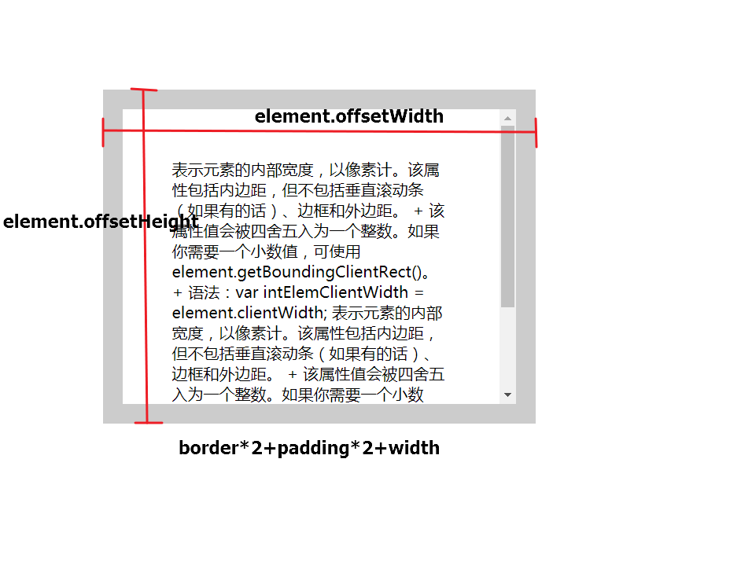

#  三大家族
> 下列介绍的三大家族的属性, 返回值一般为Number类型(有时也会是小数类型所以最好还是以小数情况计算)的整数可直接用于计算, 基本都为只读属性, `scrollTop`、`scrollLeft`为可读可写, 如果需要使用小数可以去api查找对应的属性。

## client家族

+ clientWidth, clientHeight

    1. clientWidth 表示元素的`边框`以内的宽度(不含`border`), 该属性包括`内边距`不包括`滚动条`, 且与盒模型的`content`无关;

+  clientLeft, clientTop 

    1. 表示左侧边框和上侧边框的高度, 如果滚动条在左侧,则会包括滚动条的宽度

##  offset家族

+ offsetParent

    1. 获取元素基于某个父级元素做相对定位的元素, 返回值是一个DOM元素

+ offsetWidth, offsetHeight

    1. offsetWidth 表示元素整体的宽度, 就是从左侧边框(含边框) 到 右侧边框(含边框)的宽度, 该宽度包括 padding, border, width和滚动条的宽度

+  offsetLeft, offsetTop

    1. 相对于定位元素的偏移量, 可以看做是元素定位下的 (left, top) + margin值+ 父元素的padding;
    > 相似与left 和top 但是又区别于两属性。

##  scroll家族

+  scrollWidth、scrollHeight

    1. 指的是该标签可以通过滚动条看到的所有内容(就是一个元素中可见的部分和滚动条拖动时的可见部分), 不包括滚条的宽高。

+  scrollLeft、scrollTop

    1. 该属性是可读写的, 可以直接对其进行赋值, 且该值在谷歌新版浏览器下, 当电脑的显示比例为125%情况下会获取到小数

    2. 该属性是指元素上方和左侧被滚动条隐藏起来的内容的偏移量
    
    3. 兼容问题: 

        - 老板火狐认为该属性是html的, 老板chrome认为该属性是body的, 而safari比较特别, 它有自己获取`scrollTop`的属性, window.pageYoffset(该属性在IE某个版本中为0时会返回undefined, 因此不能放在最后);

        - 兼容格式: `document.body.scrollTop` || `window.pageYoffset` || `document.documentElement.scrollTop`

##  event中的几种坐标

+  clientX、clientY: 相对于浏览器视口的(0,0) 的偏移, 不会因为滚动条的改变而改变

+  pageX、pageY: 相对于页面的(0,0)坐标的偏移量不兼容IE8; 
    - 兼容格式: `event.clientX - 兼容后的scrollLeft`; 

##  获取视口的宽高

+  window.innerWidth、window.innerHeight

参考链接: https://www.cnblogs.com/visugar/p/7247425.html
