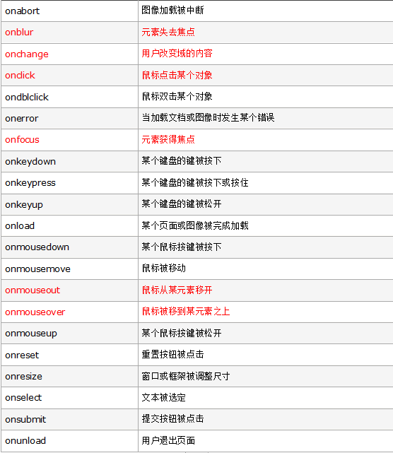

#  事件

JS 是以事件为驱动的一门语言

###  事件三要素

    1. 事件源: 触发事件的对象, 比如: button 按钮

    2. 事件: 触发事件的类型, 比如: 是 点击事件 还是 双击事件

    3. 事件驱动: 事件执行的结果, 比如: 点击按钮之后变红, 变红就是结果

###  JS执行事件的步骤

    1. 获取事件源

    2. 绑定事件

    3. 编写事件驱动

###  常见的事件
    

###  事件补充

+  oninput

###  事件对象

1. 当事件响应函数被触发的时候, 浏览器每次都会将一个事件对象作为实参传入驱动函数中(不兼容ie9以下)
> 如果事件驱动函数在标签中被调用, 且传递了参数, 需要多传一个没有定义的参数来传递event 事件对象(一般不会有这种情况)
> 在vue中使用事件对象要传递一个 $event

2. 事件对象中封装了当前事件一切相关的细节, 比如:鼠标的滚动方向, 鼠标的坐标, 键盘的哪个键被按下

3. 在ie9以下的事件对象是作为`window`的属性存在, 但不兼容火狐

4. event对象兼容格式
```
function myClick(event){
    event || window.event; 
} 
```
> event 如果是参数标识符可以改变, 如果作为`window`属性则不能改变。

###  事件冒泡

**冒泡** 指的是事件的向上传导, 当一个元素身上的事件被触发, 那么元素的父级元素或以上的相同事件都会依次被触发。

如何**阻止冒泡** 
```
event.stopPropagation(); 
// 不支持IE

event.cancelBubble = true; 
// 只支持IE, 且非IE新版浏览器已支持该属性
```

冒泡中的**注意事项** 

譬如, div跟随鼠标事件, 给document添加鼠标移动事件, 如果阻止了div的冒泡, 那么div就不会继续跟着鼠标移动, 因为document 的鼠标移动事件此时不会对div 造成影响了。因此阻止冒泡要视情况而定

###  事件委派

**事件委托** 指只绑定一次事件, 即可应用到多个元素上, 即使事件绑定以后再添加的元素也会触发改时间, 通过委托可以减少事件的绑定次数, 提高性能。

1. 委托中的this指向事件委托的元素, 即要委托ul 标签给 li 标签绑定事件, 那么this指向ul

2. 如果我们只希望我们想要的元素触发事件, 那么可以通过event.target属性

3. event.target指的是触发事件的对象, 例: 点击父元素中的a标签触发了父元素的事件, target此时就是a标签

###  事件的传播(了解)

关于事件的传播`微软`和`网景`有不同的理解, 微软认为事件应该是由内向外传播, 也就是当事件触发时, 应该先触发目标事件源的事件函数; 网景认为, 因为由外向内传播, 即先触发最外层的事件。

W3C将事件的传播分为3个阶段: 

1. 捕获阶段: 在捕获阶段, 由外向内捕获且该阶段默认不会触发事件驱动函数

2. 目标阶段: 承上启下, 事件捕获的目标元素, 捕获结束, 开始冒泡触发事件

3. 冒泡阶段: 事件会从目标元素向上冒泡执行; 从自身向外触发目标元素的事件

> 如果希望在某个事件在捕获期间执行, 可以将addEventListener()的第三个参数设置为true(一般为false)

###  绑定事件(事件监听)

通过事件监听可以给同一个事件源的同一个事件绑定多个事件驱动

1. 事件源(el).addEventListener('事件不加on',驱动函数, false(是否捕获期执行))
    - 默认冒泡执行

    - addEventListener中的this指向绑定事件对象

    - 不兼容IE9以下

2. 事件源.attachEvent('事件加on',驱动函数);

    - 和冒泡相反的顺序执行

    - this 执行window, window调用的驱动函数, 可以通过bind()指向this

###  取消监听事件

1. `removeEventListener('click',fun,false)`;
> **注意** 移动时要和绑定时的三个参数要相同

2. `detachEvent('onclick',fun)`;


