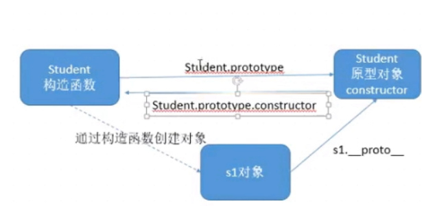
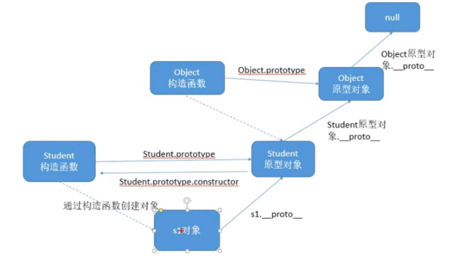
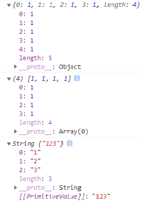

# 原型对象prototype
+	prototype的作用
	```
	- 如果在构造函数中,直接创建一个方法,会给每个对象都创建一个不同的函数对象,这样会影响程序的性能;

	- 解决方法1-全局函数:
		我们可以通过创建全局函数,然后将全局函数的函数对象赋值给方法的变量,但是这样会存函数命名重复的隐患,
	
	- 解决方法2-原型对象:
		我们创建的每个函数,解析器都会向函数中添加一个prototype属性,这个属性存着prototype对象的地址,每个函数的原型对象地址都不同;
	```
+	原型对象的应用
	```
		1. 当函数以构造函数创建对象时,对象中都会有一个隐式的属性(不可枚举属性)指向构造函数中的原型对象,可以通过 对象.__proto__来访问该对象;

		2. 原型对象就像一个公共的区域,所有同一个类型的对象都可以访问到构造函数中的原型,因此我们可以把对象中的公共内容,添加到prototype中去;

		3. 向原型对象添加方法的两种方式:

			例: 1. SayName.prototype.a = function(){};
		
				2. obj.__proto__.a = function(){};

		4. 当访问对象的属性或者方法时,会先从对象中寻找,如果没有就会去构造函数中的原型对象寻找,如果还咩有就会向原型对象中的原型对象寻(Object)找,Object中的原型对象没有原型;

		5. 使用in检查对象中有没有某属性,如果对象中没有原型中有也会返回true;

		6. 如果只想检查对象中的属性,可以使用 obj.hasOwnProperty('属性名')来检查, 该属性在Object的原型上;

		7. 原型对象中的constructor属性可以获取到当前对象的构造函数对象

		8.原型对象三角关系: 如下图
	```	
	 
	```
		9. 原型链如下图:
	```
	
	```
		10. 使用字面量创建的对象的__proto__指向Object的原型;
	```
+	Object原型对象中常见的属性
	```
		1. isPrototypeOf()
			a) 作用: 判断实例对象是不是

		2. hasOwnProperty(属性名);
			a) 作用:判断属性是否在对象中存在,不包括原型
			b) 返回值: 布尔值
		
		3. in 
			a) 作用: 判断对象和原型中是否有某个属性
			b) 返回值: 布尔值
		
		4. keys
			a) 作用: 列举对象中所有可被枚举的对象,不包含原型对象

	```
+	原型对象小知识
	```
		1. 字面量创建对象的时候,具备__proto__属性,指向Object的原型对象

		2. 普通函数(非构造函数)中也有原型对象

		3. 为什么伪数组可以通过call添加元素,String中的方法同样适合伪数组使用:
	```
	
	```
		通过String/Array.prototype.push/(attr).call(伪数组,元素);

		4. 在博客或者书本中会有人使用[[prototype]]来表示__Proto__,并不是js的语法
	```