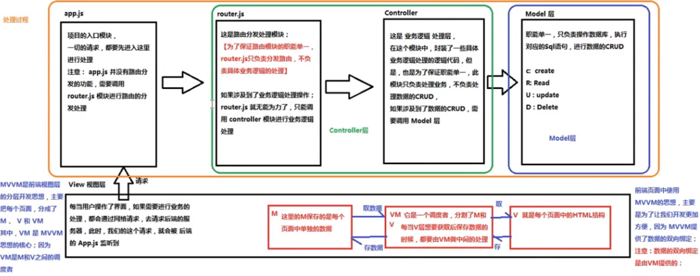

+   后端MVC与前端MVVM的区别
    ```
        - MVC是后端的分层开发概念;View 是视图层,M是model处理数据的crud, controller控制层(业务逻辑)

        - MVVM是前端视图层的概念,主要关注于视图层的分离,也就是说MVVM把前端的视图层分为: Model , View , ViewModel( VM );
    ```
+   两者的关系
    ```
        - app.js : 项目的入口,一切的请求,都要先进入这里进行处理,注意: app.js没有路由分发的功能,需要调用router.js模块进行路由的分发处理;

        - router.js
        这是路由的分发处理模块:(*为了保证路由模块的职能单一,路由模块只负责路由的分发,不负责业务逻辑的处理*) ,业务逻辑交给controller层处理
        
        - controller业务逻辑处理层,为了保证职能单一,此模块只负责处理业务,不负责处理数据的curd

        - model层操作数据库执行对应的sql语句进行数据的curd操作,create update read delete;

    ```
    ;
    ```
        V ,例: 当前页面通过ajax请求回来的数据,
        VM分隔了v和m,v和m要通过vm交互
    ```

