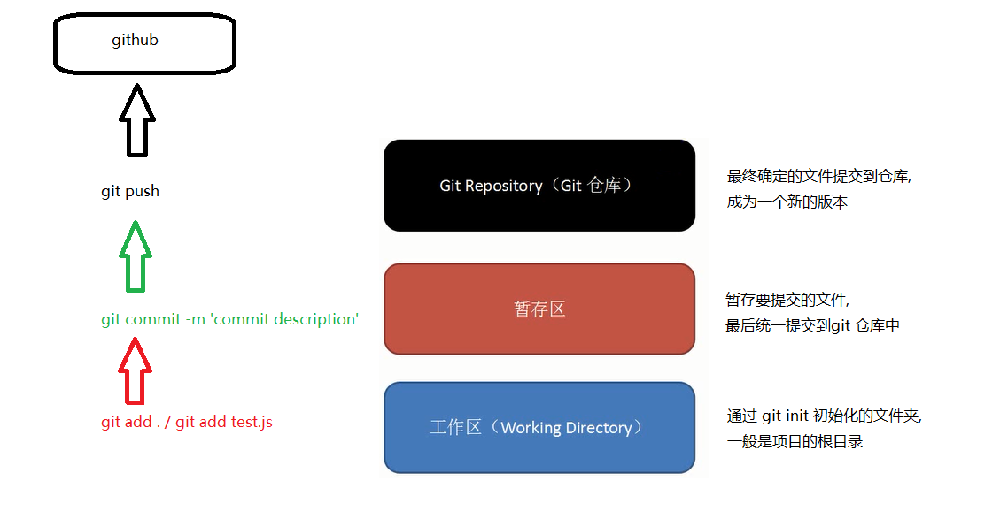

#  版本控制工具

> 为什么要用 `git/版本控制工具` ?

1. 在开发项目的时候, 可能会实现一个功能之后, 出了问题需要切换到原来的版本。

2. 在软件上线之后, 需要继续开发新功能, 可以新建一个版本分支, 对该分支进行开发, 测试成功之后, 在把版本分支和主分支合并。

##  git常用命令

###  初始化git仓库

命令: `git init`

作用: 在当前文件夹中通过 git init 初始化仓库,会在文件夹中创建一个.git(隐藏文件)文件, 这个仓库会存放,git对我们项目代码进行备份的文件;

###  配置使用者的用户名和邮箱

配置使用者的用户名和邮箱, 提交的时候会表明是哪个用户提交

命令: (邮箱不需要真实存在, 但要符合邮箱规则)
```
> git config --global user.name 'username'
> git config --global user.email 'email...'
```

###  添加到暂存区

**git存储图解** , 如下图: 



        
        3. 添加到暂存区
            - git add .

        4. 提交到仓库
            - git commit -m'注释'

        5. 查看上传记录/日志(时光机)
            - git log ,查看所有commit的历史记录
                在分支中 查看日志会查看到主分支的日志,在主分支查看日志不会显示其他分支的日志
               
            - git log --oneline 查看简介的日志

            - 记录中 head HEAD -> master 指向那个哈希值(哈希值是唯一的),哪个就是当前的版本

            - git reset --header hash xxx,跳到当前版本,但是没有删除其他的版本;
              git reset --hard HEAD~0 跳转到上一次提交的版本
              git reset --hard HEAD~1 跳转到上上一次提交的版本
              git reset --hard 哈希值 跳转到上上一次提交的版本

            - git reflog ,可以看到每一次切换版本的记录;

        6. 创建分支,默认有一个master主分支
            - git branch xx 创建分支

        7. 查看分支
            - git branch 查看当前的所有分支
            - 当前分支是前面有*号的分支

        8. 切换分支
            - git checkout xx 切换分支
            - git checkout master 回到主版本   

        10. 合并分支
            - git merge dev 把当前的分支和指定的分支(dev)进行合并 
            - 合并时候如果有冲突conflict,需要手动处理之后再提交;
        11. 删除分支
            - git branch -d dev 删除分支, 当前不能下不能删除当前分支,需要切换到别的分支下 
        
        12. push提交到远程仓库
            - git push git仓库地址 分支名 ,把当前分支上传到远程分支的master分支上

        13. pull下载远程仓库的数据,包括日志信息
            - git pull git仓库地址 分支名,会拉下来远程仓库上有,而本地仓库没有的内容

        14. clone,克隆仓库中数据,不需要创建本地仓库,且会把远程仓库名创建为文件夹名
            - 如果执行多次会覆盖本地内容 
            - git clone 仓库地址

        15. 通过ssh上传代码
            - 公钥 私钥,两者是有关联的;
            - 生成公钥和私钥,打开git命令行在任何目录都可以
                ssh-keygen -t rsa -C "邮箱"
                // 生成的秘钥会保存到c盘/user/isc/.ssh
                _ras(私钥) / _ras.pub(公钥) 
                打开复制所有,在github个人设置中添加SSH key 

        16. 冲突,文件不一样,版本不一样
            多人开发的时候push的时候先pull,先pull,如果版本和本地不同,我们可以把冲突先解决,然后把最先的版本push上去;

        17. pull和push 简写方式
            - git命令行下选中内容下次粘贴的就是选中的内容    
        
        18. 添加远程地址
            - git remote add origin 给本地仓库添加远程仓库地址

            添加过之后直接git push origin master就可以 
            如果添加git push -u origin master之后,以后直接git push就可以
            -u git会把当前分支和远程分支关联;


        19 文件没有被忽略
        git rm -r --cached .
        先添加了文件 后添加了gitignore后发现无法忽略文件更新   需要用上面的命令清楚缓存 即可忽略配置的文件   

        20. checkout
        - 命令: git checkout xxx

        - 作用: 如果暂存区有内容,会把暂存区的内容检出到工作区;

        - 作用: 如果暂存区没内容,会把存储区的内容检出到工作区;

        - 注意: 谨慎使用该命令,一旦使用,不可撤销;
    ```
+   .gitignore()
    ```
        - 在window操作系统无法直接创建
    ```
+   ssh 问题 pull