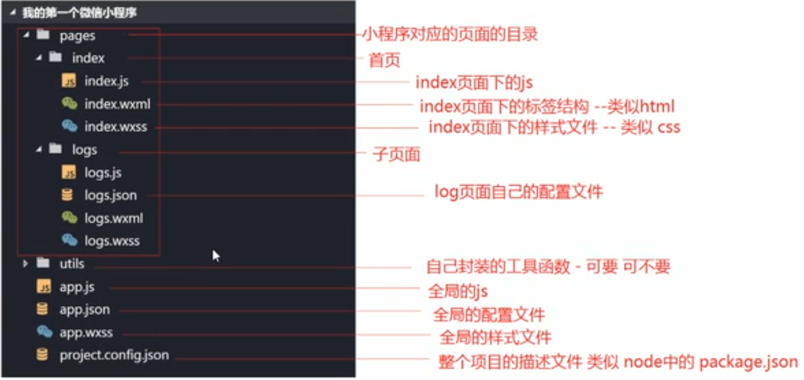

#  微信小程序

##  什么是小程序

1. 触手可及

2. 用完即走

3. 无需安装卸载

通过以上三点实现更好的应用体验

###  小程序与app应用的区别

1. 无需安装

2. 不占内存

3. 易传播

##  准备

> **注意:** 注册时的邮箱不能是我们微信公众平台注册过的邮箱, 也不可以是个人微信号绑定过的邮箱

> APPID 

> 修改微信小程序中的data, 要通过setData({ attr : xx }) 的形式修改, 否则修改不会被响应。

> 小程序请求的url 必须是https开头的, 开发的时候, 点击小程序开发者工具中的详情, 选中不校验合法域名。

##  1 微信小程序项目结构

1. 小程序的页面是由四部分组成, WXML, WXSS, JS, JSON

##  2 配置介绍

一个小程序包括两种最基本的配置: 1. 全局的app.json; 2. 页面和自己的page.json

> **注意:** 配置文件中不能出现配置(json文件中不允许出现注册)

###  2.1 全局配置app.json

`app.json`是当前小程序的全局配置, 包括了小程序的所有页面路径, 界面表现, 网络超时时间, 底部tabbar等。

+ 字段含义:
    
    - `pages`: 指的是整个小程序中页面的每个页面路径和数量

    - `window`: window中的配置基本都是外观的设置, 包括头部栏背景, 是否允许下拉刷新等。

###  配置tabbar

如果小程序是一个多页面的应用, 可以通过在window中配置tabbar(顶部或底部)来切换显示对应的页面。

###  数据绑定

###  
open-type 是微信开放能力 : getUserInfo  // 获取用户信息

