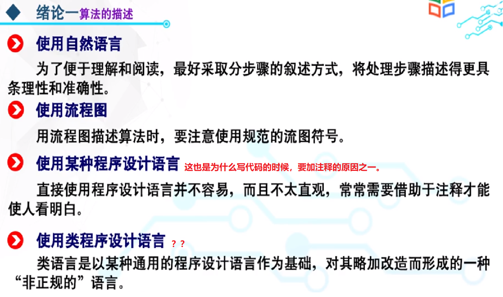

#   数据结构

##  什么是数据结构
> 程序 = 算法 + 数据结构
> 程序设计的实质,就是对 确定的问题 选择 一种好的结构 加上 一种好的算法。
> 数据结构是算法实现的基础, 算法总是要依赖于某种数据结构来实现
### 数据结构概述
> 1946年情人节，世界上第一台电脑ENIAC在美国宾夕法尼亚大学诞生
> 当时是用来进行计算弹道的, 当时计算机的研制主要用于数值计算。
> 发展到现在,计算机处理的数据也由纯粹的数值,发展到 字符, 表格, 图形, 图像, 声音等非数值的数据。

### 三种基本数据逻辑结构

+   线性结构: 一对一

+   树形结构: 一对多

+   图形结构: 多对多

##  算法概念
> 算法简单来说就是解决问题的方法。在计算机领域我们可以说算法是有限的指令序列。

> 算法的含义与程序十分相似, 但又有区别。程序中的指令必须是机器可执行的, 而算法中的指令则无此限制。

> 一个算法如果要程序设计语言来描述, 则它就是一个程序。

### 算法的特性

+   0个或多个输入: 绝大多数的算法, 输入参数是必要的, 但是也有个别情况, 比如, 仅仅要求输出一段文字

+   至少有一个输出: 输出就是把结果呈现出来, 问题解决了,结果不呈现。有意义吗?

+   有穷性: 一个算法在执行有限步骤后可以呈现。不然会出现死循环

+   确定性: 算法的每一步都必须有确切的意义, 不会出现二义性

+   可行性: 算法中的每一步都是可行的, 每一步都能通过执行有限的次数完成。(也就是指算法可以转换成程序 在机器上运行 并得到正确的结果)

### 算法要求
> 一个好的算法应该具备以下四点要求

+   算法要正确: 算法的执行结果应当满足预先规定的功能和性能要求。

+   可读性: **算法首先应该是便于人们理解和相互交流,其次才是机器可执行**。所以一个算法应该思路清晰,层次分明.简单明了,易读易懂。

+   健壮性: 作为一个好的算法,当输入不合法的数据时, 应该适当的做出正确反应或进行相应的处理, 而不至于产生一些莫名其妙的输出结果。

+   高效率低存储: **算法效率通常指算法的执行时间。** 对于同一个问题如果有多个算法可以解决, 执行时间最短的效率最高。所谓存储量的要求,是指算法在执行过程中所产生的的最大存储空间。这两者都与问题的规模有关。

### 算法的描述

### 算法评价(算法效率的评价方法)
> 少花时间, 少用空间
> 常说的算法效率, 大多指执行时间。

+   利用计算器,统计运行时间,从而确定算法效率的高低。(这种测试方式有很大的缺陷)

1. 首先要使用算法编制好程序时才能测试算法效率,如果程序存在缺陷就会前功尽弃。

2. 时间的比较又依赖于计算机的硬件和软件的坏境因素,有时会遮盖算法本身的优劣。

3. 算法的测试数据, 算法的高效有时候和数据的规模有关, 效率高的算法在小规模的测试数据面前往往得不到体现。

+   估算法

